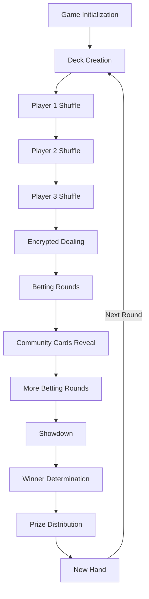
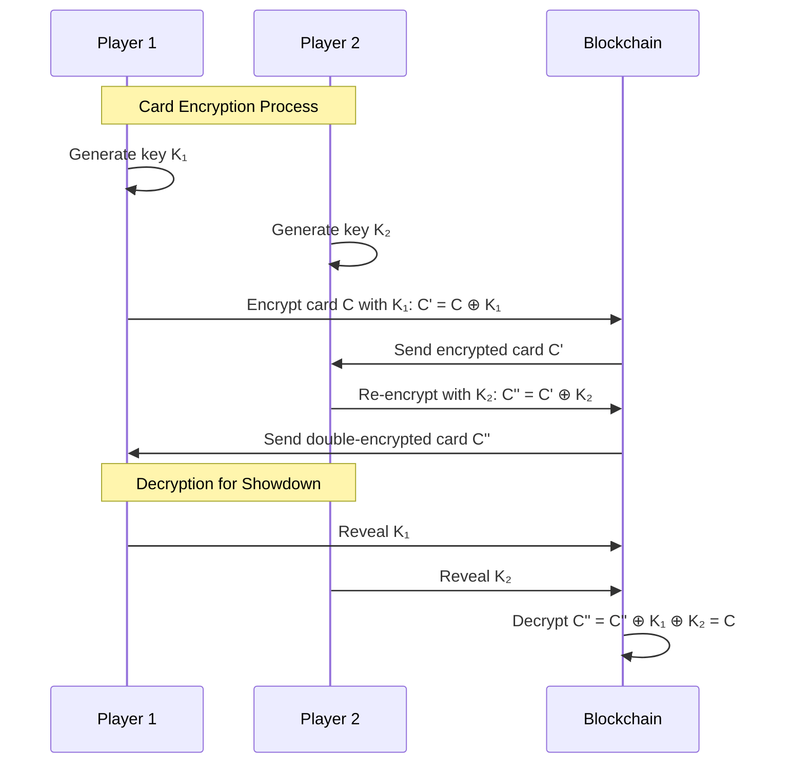
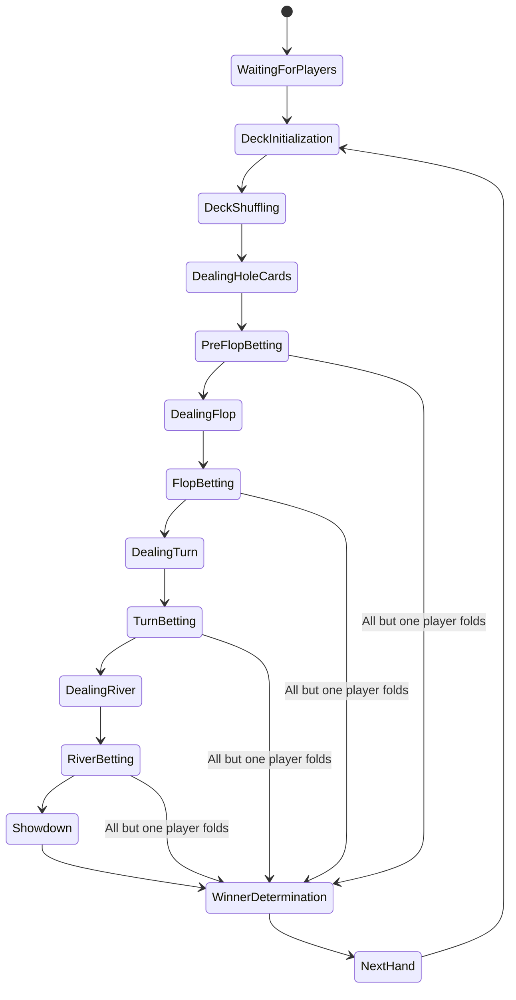
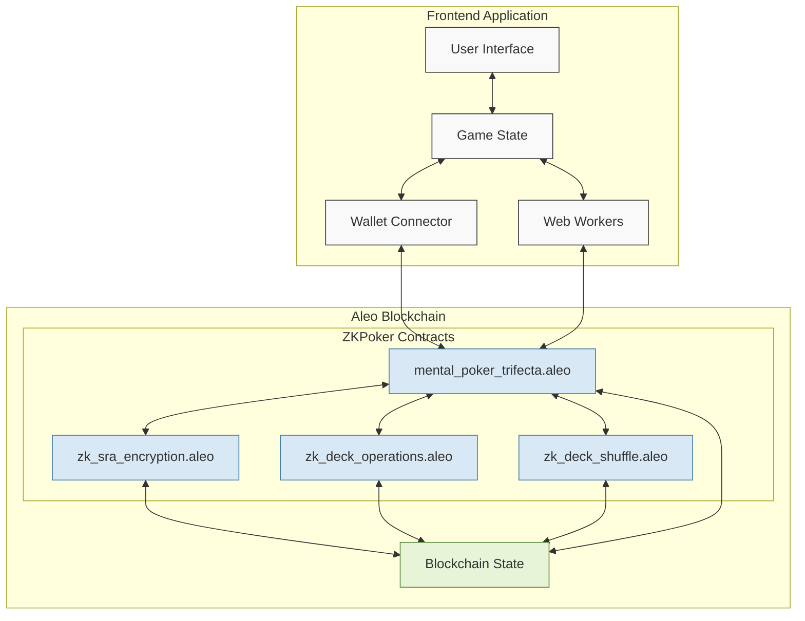
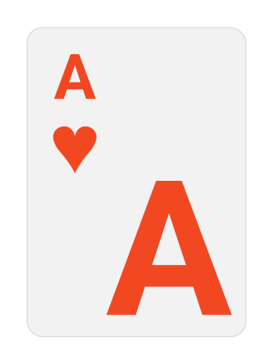
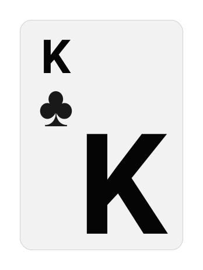
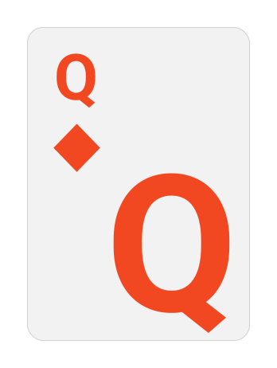
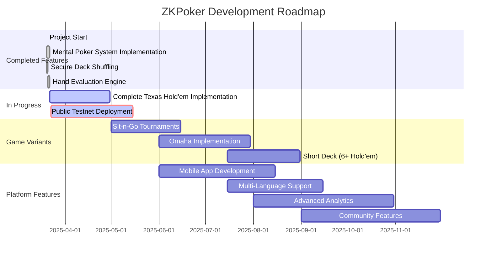

# ZKPoker: Mental Poker on Aleo

<div align="center">
  
  <p><strong>Trustless, Decentralized Poker Powered by Zero-Knowledge Proofs</strong></p>
</div>

## Table of Contents

- [Overview](#overview)
- [Demo](#demo)
- [Features](#features)
- [How It Works](#how-it-works)
- [Mental Poker Implementation](#mental-poker-implementation)
    - [SRA Protocol with Modifications](#sra-shamir-rivest-adleman-protocol-with-modifications)
    - [Secure Deck Shuffling](#secure-deck-shuffling)
    - [Game State Management](#game-state-management)
- [Aleo Smart Contracts](#aleo-smart-contracts)
- [Architecture](#architecture)
- [Repository Structure](#repository-structure)
- [Challenges](#challenges)
    - [Circuit Complexity](#1-circuit-complexity)
    - [Multi-Party Protocol Design](#2-multi-party-protocol-design)
    - [Private Information Management](#3-private-information-management)
    - [User Experience](#4-user-experience)
    - [Wallet Integration](#5-wallet-integration)
- [Getting Started](#getting-started)
    - [Prerequisites](#prerequisites)
    - [Installation](#installation)
    - [Smart Contract Deployment](#smart-contract-deployment)
- [Deployments](#deployments)
- [Tech Stack](#tech-stack)
- [Future Roadmap](#future-roadmap)
- [ETHGlobal Submission](#ethglobal-submission)
- [Contributing](#contributing)
- [License](#license)
- [Acknowledgments](#acknowledgments)

<div align="center">
  <p><em>EthGlobal Trifecta 2024 Hackathon - ZK Track Submission</em></p>
  
  
</div>

## Overview

ZKPoker is a trustless, decentralized poker platform powered by zero-knowledge proofs built on Aleo. Our implementation of mental poker eliminates the need for a trusted third party to deal cards or manage the game, ensuring complete fairness and true decentralization.

Most existing web3 poker solutions still rely on centralized components for card dealing and verification. ZKPoker solves the fundamental issue of "mental poker" - playing a fair card game without a trusted dealer - using modern cryptography and Aleo's privacy-preserving execution environment.

<div align="center">
  
</div>

<div align="right">
  <a href="#top">Back to Top ↑</a>
</div>

## Demo

- **Live Demo**: [https://zkpoker.vercel.app](https://zkpoker.vercel.app)
- **Video Demo**: [Watch on Loom](https://www.loom.com/share/1d3ee014b3d44503bcee0f3fa8351f83?sid=df3c18d1-9c54-4628-a665-1a570349cba3)

<div align="right">
  <a href="#top">Back to Top ↑</a>
</div>

## Features

- **Fully Decentralized Card Games**: No trusted dealer or central server needed for shuffling and dealing cards
- **Provably Fair**: Zero-knowledge proofs ensure fairness without revealing players' cards
- **Privacy Preserving**: Players' strategies and hands are kept private until showdown
- **On-chain Game Logic**: All game mechanics run on Aleo smart contracts
- **Beautiful UI**: Modern, intuitive interface for seamless gameplay
- **Wallet Integration**: Connect with Leo wallet for secure authentication
- **Responsive Design**: Play on any device with adaptive layout

<div align="center">
  
</div>

<div align="right">
  <a href="#top">Back to Top ↑</a>
</div>

## How It Works

ZKPoker uses advanced cryptographic techniques to implement mental poker protocols on Aleo:

1. **Secure Shuffling**: Players collaboratively shuffle an encrypted deck without seeing card values
2. **Private Card Dealing**: Cards are dealt to players while preserving privacy
3. **Verifiable Actions**: All player actions (check, bet, fold) are validated on-chain
4. **Zero-Knowledge Showdown**: Only revealed hands are compared at showdown, maintaining privacy



<div align="right">
  <a href="#top">Back to Top ↑</a>
</div>

## Mental Poker Implementation

Mental poker is a cryptographic problem of playing a fair card game over a distance without a trusted third party. Our implementation combines several techniques:

### SRA (Shamir-Rivest-Adleman) Protocol with Modifications

We use a modified version of the SRA protocol for secure card operations:

1. **Card Representation**: Each card is represented as a unique 128-bit number
2. **Card Transformation**: We use simple XOR operations for encryption/decryption to minimize ZK circuit complexity
3. **Multi-Key Encryption**: Cards are encrypted with player-specific keys, requiring cooperation for decryption

```leo
// From zk_sra_encryption.aleo
function transform_card(card: u128, key: u128) -> u128 {
    return card ^ key; // Simple XOR operation
}
```



<div align="right">
  <a href="#top">Back to Top ↑</a>
</div>

### Secure Deck Shuffling

We implement a secure shuffling protocol where multiple players participate:

1. **Initial Deck Creation**: A standard 52-card deck is initialized
2. **Player Shuffling**: Each player applies their own secret shuffle to the encrypted deck
3. **Zero-Knowledge Verification**: Players prove they performed a valid shuffle without revealing the permutation

```leo
// From zk_deck_shuffle.aleo
transition full_shuffle(
    seed1: i8,
    seed2: i8,
    seed3: i8,
    deck: [[u128; 26]; 2]
) -> [[u128; 26]; 2] {
    // Complex shuffling logic goes here
    // ...
    return shuffled_deck;
}
```

<div align="right">
  <a href="#top">Back to Top ↑</a>
</div>

### Game State Management

The main contract manages the poker game state, including:

- Player turns and actions
- Blinds and betting rounds
- Card dealing and community card revelation
- Showdown and winner determination

```leo
// From mental_poker_trifecta.aleo
struct Game {
    player1: address,
    player2: address,
    player3: address,
    buy_in: u64,
    deck: [[u128; 26]; 2],
    state: u8,
    dealer_button: u8,
    players_out: u8,
    players_folded: u8,
    // Additional fields...
}
```



<div align="right">
  <a href="#top">Back to Top ↑</a>
</div>

## Aleo Smart Contracts

Our implementation consists of four interconnected Aleo programs, maintained in a separate repository as a Git submodule in the `leo-program` directory. The contracts repository is available at [https://github.com/henrikkv/poker](https://github.com/henrikkv/poker).

### 1. mental_poker_trifecta.aleo (Main Contract)

The core contract managing the poker game, player actions, and state transitions:

- **Game Creation**: Initialize new games with blinds and buy-ins
- **Player Management**: Handle joining, betting, and folding
- **Game Flow**: Control betting rounds and turn progression
- **State Machine**: Manage the complex state transitions of a poker game

### 2. zk_sra_encryption.aleo

Implements the cryptographic primitives for card operations:

- **Card Encryption**: Transform cards using player-specific keys
- **Card Decryption**: Allow selective revelation of cards
- **Multi-Card Processing**: Efficiently handle operations on multiple cards

### 3. zk_deck_operations.aleo

Handles operations on the entire deck:

- **Deck Encryption**: Encrypt the entire deck in parts
- **Card Selection**: Extract and process specific cards
- **Hand Creation**: Form player hands and community cards

### 4. zk_deck_shuffle.aleo

Implements secure shuffling algorithms:

- **Permutation Generation**: Create unpredictable yet verifiable card orderings
- **Multi-Party Shuffling**: Allow each player to contribute to the shuffle
- **Shuffle Verification**: Ensure the integrity of the shuffle

<div align="center">
  
</div>

<div align="right">
  <a href="#top">Back to Top ↑</a>
</div>

## Architecture

Our ZKPoker implementation follows a modular architecture that separates concerns while allowing for secure interactions between components:



The architecture enables:

1. **Decentralized Execution**: All game logic runs on the Aleo blockchain
2. **Client-Side Cryptography**: Web Workers handle heavy cryptographic operations
3. **Modular Design**: Each contract has a specific responsibility
4. **Secure Communication**: All on-chain interactions are verifiable and private

<div align="right">
  <a href="#top">Back to Top ↑</a>
</div>

## Repository Structure

The ZKPoker project is organized with a clear separation of concerns:

```
zkpoker/
├── src/                    # Frontend application source code
│   ├── app/                # Next.js application routes
│   ├── components/         # React components
│   ├── services/           # Service modules (sound, game logic)
│   └── worker-poker.ts     # Web Worker for Aleo operations
├── public/                 # Static assets
│   ├── cards/              # Card images
│   ├── sounds/             # Game sounds and music
│   └── *.svg               # UI elements and icons
├── leo-program/            # Git submodule for Aleo contracts
│   ├── src/                # Main contract code
│   ├── imports/            # Dependent contract modules
│   │   ├── zk_sra_encryption/
│   │   ├── zk_deck_operations/
│   │   └── zk_deck_shuffle/
│   └── build/              # Compiled contract artifacts
├── deployments.md          # Deployment records and transaction IDs
└── README.md               # Project documentation
```

Our contract code is maintained in a separate repository at [https://github.com/henrikkv/poker](https://github.com/henrikkv/poker) and included as a Git submodule in the `leo-program` directory. This separation allows for independent versioning and deployment of the smart contracts.

To clone the repository with the submodule:

```bash
git clone --recurse-submodules https://github.com/yourusername/zkpoker.git
```

Or if you've already cloned the repository:

```bash
git submodule update --init --recursive
```

<div align="right">
  <a href="#top">Back to Top ↑</a>
</div>

## Challenges

Building a trustless poker platform on Aleo presented several significant challenges:

### 1. Circuit Complexity

Zero-knowledge proof generation for complex operations like shuffling is computationally intensive. We optimized our implementation by:

- Breaking down shuffle operations into smaller steps
- Using XOR-based encryption instead of more complex cryptography
- Optimizing data structures for Leo's constraints

### 2. Multi-Party Protocol Design

Coordinating multiple players in a decentralized environment required careful protocol design:

- State machine with clear transitions for each player action
- Fallback mechanisms for disconnections or timeouts
- Incentive structures to prevent cheating

### 3. Private Information Management

Balancing privacy with gameplay verification:

- Ensuring players can't see others' hole cards
- Allowing selective revelation during showdown
- Preventing collusion between players

### 4. User Experience

Creating a smooth experience despite blockchain constraints:

- Implementing optimistic UI updates before on-chain confirmation
- Handling transaction failures gracefully
- Providing appropriate feedback during cryptographic operations

### 5. Wallet Integration

Integrating with Aleo wallets presented unique challenges:

- **Limited Wallet Ecosystem**: The Aleo ecosystem is still emerging, with fewer wallet options compared to EVM chains
- **Adapter Compatibility**: We faced issues with version compatibility in the `@demox-labs/aleo-wallet-adapter` packages
- **Transaction Signing**: Implementing proper request handling for transaction signing and decryption permissions
- **Error Handling**: Working around unpredictable wallet behavior during connection and transaction signing
- **Web Worker Integration**: Coordinating between the main thread and web workers for wallet operations

To overcome these challenges, we implemented:

```javascript
// Custom wallet connection handling with fallbacks
useEffect(() => {
    if (!connected && publicKey) {
        console.log('Wallet not connected. Please connect your wallet to play.')
        setGameNotification({
            message: 'Please connect your wallet to play',
            type: 'error',
        })
    }
}, [connected, publicKey])

// Web Worker communication for blockchain operations
if (aleoWorker) {
    aleoWorker.postMessage({
        type: 'create_game',
        gameId,
        privateKey,
        buyIn: playerData.chips,
    })
}
```

<div align="right">
  <a href="#top">Back to Top ↑</a>
</div>

## Getting Started

### Prerequisites

- Node.js 18+
- pnpm 8+
- Leo (Aleo SDK)
- A Leo-compatible wallet (like Leo Wallet extension)

### Installation

1. Clone the repository with submodules

```bash
git clone --recurse-submodules https://github.com/yourusername/zkpoker.git
cd zkpoker
```

2. Install dependencies

```bash
pnpm install
```

3. Start the development server

```bash
pnpm dev
```

4. Open [http://localhost:3000](http://localhost:3000) in your browser

<div align="right">
  <a href="#top">Back to Top ↑</a>
</div>

### Smart Contract Deployment

To deploy the Leo programs to Aleo:

1. Navigate to the Leo program directory

```bash
cd leo-program
```

2. Build the programs

```bash
snarkvm build
```

3. Deploy to Aleo local testnet

```bash
leo deploy --recursive -y
```

<div align="right">
  <a href="#top">Back to Top ↑</a>
</div>

## Deployments

Our contracts are currently deployed on the Aleo local testnet using [Amareleo Chain](https://amareleo.com/). We use Demox Labs for other purposes, but they are not related to Amareleo.

Here's a summary of our deployment costs to the local testnet:

### Program Deployment Summary

| Program                    | Transaction ID                                                | Cost (credits) |
| -------------------------- | ------------------------------------------------------------- | -------------- |
| zk_deck_shuffle.aleo       | at1pvpkuumy3r56eqyszyyt85ml6uzjfj3v23alau3d0z7s594jm5yqpl4lp0 | 108.432550     |
| zk_sra_encryption.aleo     | at12cvm6ucvyeagkgf32ca93yh8m2h2lm5222xqdr84ak7n5rga7ygqra5uz5 | 13.611800      |
| zk_deck_operations.aleo    | at1a2tsk3mj2sdc5a9yrnh5cxmjac7jp09zu4ekl6t99jy7hgc5nyzqc37fnl | 41.227700      |
| mental_poker_trifecta.aleo | at1rk88g2nwcjzdq75pfnsz0a6xd00gjgewvswzjzkxrzuaczn7qvxqexpmc0 | 46.994400      |

For detailed deployment information, see our [deployments.md](deployments.md) file.

<div align="right">
  <a href="#top">Back to Top ↑</a>
</div>

## Tech Stack

### Frontend

- **Next.js 15**: React framework with App Router
- **React 19**: UI library
- **TypeScript**: Type-safe JavaScript
- **Tailwind CSS**: Utility-first CSS framework
- **Howler.js**: Audio library for game sounds
- **Leo Wallet Adapter**: Connect with Leo wallets

### Blockchain

- **Aleo**: Privacy-focused L1 blockchain
- **Leo**: Language for zero-knowledge applications
- **SnarkVM**: Execution environment for Aleo programs
- **Web Workers**: Handle heavy cryptographic operations off the main thread

### Development Tools

- **ESLint/Prettier**: Code formatting and linting
- **pnpm**: Fast, disk-efficient package manager
- **VS Code**: Recommended editor with Leo extensions
- **Git Submodules**: Manage contract code separately from frontend

<div align="center">
  <div style="display: flex; justify-content: center; gap: 20px;">
    
    
    
    
  </div>
</div>

<div align="right">
  <a href="#top">Back to Top ↑</a>
</div>

## Future Roadmap



### Improved Texas Hold'em Implementation

- **Advanced Betting Rules**: Implement full No-Limit Texas Hold'em betting structure
- **Hand Evaluation**: Complete 5-card combination evaluation for accurate hand strength calculation
- **Side Pots**: Support for multiple side pots in all-in scenarios
- **Tournament Structure**: Blind level increases and elimination progression

### New Game Modes

- **Sit-n-Go**: Quick tournament format with 6-9 players
- **Multi-Table Tournaments**: Support for larger player pools with table balancing
- **Omaha**: Four-card variant with more complex drawing possibilities
- **Short Deck**: Remove 2-5 cards for more action-packed gameplay

### Enhanced Features

- **Mobile App**: Native mobile experience with push notifications
- **Multi-Language Support**: Internationalization for global audience
- **Advanced Analytics**: Hand history and strategy tools for players
- **Community Building**: Chat functions, player profiles, and achievements

### Technical Improvements

- **Public Testnet Deployment**: Resolve current 500 errors and deploy to public Aleo testnet
- **Optimized Circuits**: Further reduction in ZK circuit complexity
- **Improved Tutorial**: Step-by-step onboarding for new players
- **Enhanced Security**: Additional measures to prevent collusion and cheating
- **Wallet Compatibility**: Support for additional Aleo wallets as they become available

<div align="center">
  
  
  
  
</div>

<div align="right">
  <a href="#top">Back to Top ↑</a>
</div>

## ETHGlobal Submission

ZKPoker was submitted to the ETHGlobal Trifecta 2024 Hackathon in the Zero Knowledge track.

- **Submission Page**: [https://ethglobal.com/showcase/mental-poker-1e0kd](https://ethglobal.com/showcase/mental-poker-1e0kd)

### Project Description

Mental Poker is a trustless multiplayer poker game built on the Aleo blockchain, leveraging zero-knowledge proofs and commutative SRA encryption to ensure privacy and fairness. In traditional poker games on-chain, card data is public by default due to transparent ledgers. Our system solves that by enabling all players to encrypt the deck without revealing any card content.

Each player encrypts the deck with their own key and shuffles it. Due to the commutative nature of the encryption, cards can later be revealed only after all players have decrypted them in reverse order. This allows players to reveal only the cards they need to see—no one has access to the full deck.

The game flow is maintained using a custom state machine that enforces turn logic, manages card states, and validates plays. All key cryptographic operations are executed through Aleo's Leo language, which compiles into provable logic to maintain game integrity without exposing player data.

This project demonstrates how zero-knowledge cryptography can enable provably fair games on-chain without compromising privacy.

### How it's Made

We built Mental Poker using Aleo's zero-knowledge framework and Leo programming language to handle encrypted card logic, deck shuffling, and multi-party decryption. Each card is a ciphertext encrypted using SRA commutative encryption, implemented in Leo.

The frontend is built using TypeScript and communicates with the game logic via Leo Smart Contract. Players interact with a browser-based UI that manages the state machine for turn-based gameplay, using local signatures and on-chain proof verification.

The core state machine handles actions like: shuffle, encrypt, decrypt, deal, and reveal — each represented as separate Leo programs producing zero-knowledge proofs. These proofs are used to validate actions without exposing private data on-chain.

We implemented SRA manually within Leo due to its unique commutative property and built a modular game client that supports adding more games using similar mechanics in the future. All of the gameplay functionality lives on the smart contract. There's no centralized server — the entire logic is designed to be distributed and trust-minimized, showcasing a practical zero-knowledge application.

<div align="right">
  <a href="#top">Back to Top ↑</a>
</div>

## Contributing

We welcome contributions to ZKPoker! Please see our [CONTRIBUTING.md](CONTRIBUTING.md) file for guidelines.

<div align="right">
  <a href="#top">Back to Top ↑</a>
</div>

## License

This project is licensed under the MIT License - see the [LICENSE](LICENSE) file for details.

<div align="right">
  <a href="#top">Back to Top ↑</a>
</div>

## Acknowledgments

- The Aleo team for their incredible platform and tools
- [Amareleo](https://amareleo.com/) for their support with a light local testnet
- EthGlobal Trifecta 2024 for the opportunity to showcase this project
- The mental poker research community for laying the cryptographic foundations
- [Puzzle Wallet](https://github.com/puzzlehq) team for their support with wallet compatibility issues

---

<div align="center">
  <p>Built with ❤️ by the ZKPoker Team for EthGlobal Trifecta 2024</p>
</div>
